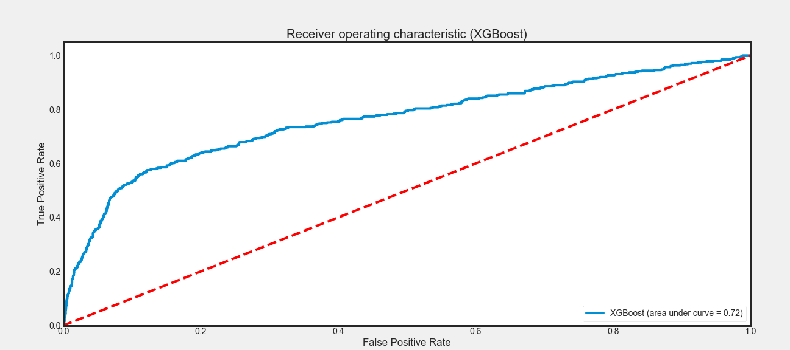

# 
Bank Institution Term Deposit Predictive Model

**Business Need**

The investment and portfolio department would want    
to be able to identify their customers who potentially would subscribe to their term
deposits. As there has been heightened interest of marketing managers to carefully tune
their directed campaigns to the rigorous selection of contacts, the goal of your employer
is to find a model that can predict which future clients who would subscribe to their term
deposit. Having such an effective predictive model can help increase their campaign 
efficiency as they would be able to identify customers who would subscribe to their
term deposit and thereby direct their marketing efforts to them. This would help them 
better manage their resources (e.g human effort, phone calls, time) 
The Bank of Portugal, therefore, collected a huge amount of data that includes
customers profiles of those who have to subscribe to term deposits and the ones who
did not subscribe to a term deposit. As their newly employed machine learning
researcher, they want you to come up with a robust predictive model that would help
them identify customers who would or would not subscribe to their term deposit in the
future. 
The main goal as a machine learning researcher is to carry out data exploration, data
cleaning, feature extraction, and developing robust machine learning algorithms that
would aid them in the department. 

Data Description can be found <a href="https://archive.ics.uci.edu/ml/datasets/Bank+Marketing"> here </a>

### To Run the code for training and evaluation :
1. Clone the repo and run main.py as given below
2. pip3 install -r requirements.txt

**To Run a baseline without evaluation results**

py .\main.py  --data '../data/bank-additional-full.csv' 

**To run a specific model for all available models and get evaluation reports**

py .\main.py  --data 'data location' --model 'model-name' e.g

py .\main.py  --data '../data/bank-additional-full.csv' --model 'random-forest'

*some of the models you can use are*
1. Logistic Regression use 'log-reg'
2. eXtreme Gradient Boost  use 'xgb'
3. Multilayer perceptron use 'mlp'
4. Random Forest use 'random-forest'
5. Gradient Boosting use 'grb'

Note that if model is not specified default will be 'logistic regression'

Upcoming Update will accept argument to predict on test data and save predictions to local machine

if code succesfully runs it returns an ROC curve image that is saved on the local machine and built model is saved as well with a time stamp and model name. 
similar to this depending on which model

### References
1. <a href='https://archive.ics.uci.edu/ml/datasets/Bank+Marketing'> UCI Data </a> 

2. <a href='medium.com/@abbdar/first-steps-in-machine-learning-predicting-subscription-for-bank-deposits-866516b90e4'> marketing analysis </a>

3. <a href='featureranking.com/tutorials/machine-learning-tutorials.data-preparation-for-machine-learning/#2.3'> Data Preprocessing </a>
